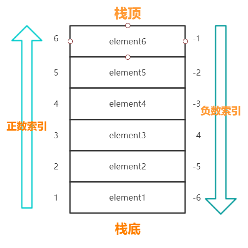
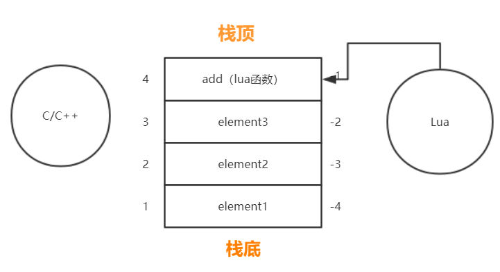
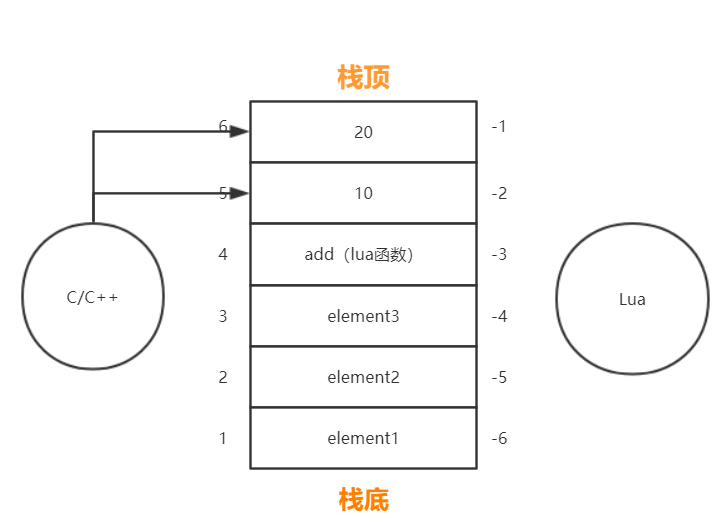
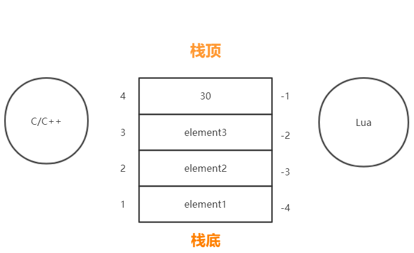

### 1.SDK接入流程：lua java 交互，Java类要求，参数传输
Lua调用Java:    Lua -> C++ -> Java

```

luaj.callStaticMethod
--[[
@function: 调用java的接口，注意在使用的时候一定要判定是否为为Android平台
    @param: className Java完整的类名
    @param: methodName Java类方法名
    @param: args lua传入的参数，要为table类型，否则会被转换{}
    @param: sig 类型简写名，格式为：(参数简写)返回类型简写
]]

```

1. lua调用java的类方法，其中java方法一定要为static类型
2. lua调用Java的方法一定要判定是否为Android平台，若在游戏中也要判定当前游戏的基础版本是否支持调用该SDK
3. 使用luaj.callStaticMethod时，注意第三个参数args一定要为table类型，否则将被转换{},导致错误

--[[
  JAVA静态方法与非静态方法
1.静态方法不需要类实例化就可以调用，反之非静态方法需要实例化后才能调用；
2.静态方法只能访问静态成员和方法，非静态方法都可以访问；
3.静态方法不能标记为override，导致派生类不能重写，但是可以访问；
4.静态成员是在第一次使用时进行初始化。非静态的成员是在创建对象的时候，
从内存分配上来说静态是连续的，非静态在内存的存储上是离散的，因此静态方法和非静态方法，
在调用速度上，静态方法速度一定会快点，因为非静态方法需要实例化，分配内存，但静态方法不用，但是这种速度上差异可以忽略不计

--]]

Lua类型	Lua简写	说明
number	F	浮点类型
boolean	Z	布尔类型
function	I	整数或Lua function
string	
Ljava/lang/String;
字符串
 	
V
用于java方法中无返回值


### 2.lua 热更新机制 +  包覆盖安装如何清理热更新缓存

 unity 热更 ab框架 :

 cocos:a. 将包存储到服务器
       b. 客户端通过www请求，首先下载服务器中的资源效验文件（有的为了节省流量，在客户端存储一份资源效验文件，先比对资源效验文件）
       c.进行本地md5与服务器资源效验文件里的md5码进行比对，如果发生更新，客户端发起请求进行下载更新资源

  断点续传：热更时，增加utmp目录；网络不稳定时，需要进行断点续传。有的已经下载好了，就不重新进行下载了，这个就时utmp 目录的作用
  单个文件（如file.zip)断点续传：断点续传功能最核心的原理就是利用HTTP请求中的两个字段：客户端请求头中的Range，和服务端响应头的Content-Range。
  Range： bytes=200000-    //告诉服务器 file.zip 这个文件从200000字节开始传，前面的字节不用传了


  官方版:AssetsManagerEx(C++)
  社区版:纯lua 热更新


### 3.cocos 渲染 + 合图降低GPU压力的原理:

#### 合图降低GPU压力原理
 --[[
   【合图降低GPU压力原理】在资源层面进行散图合并，保证UI节点使用的都是同一张贴图，因为同一张图集的纹理状态都是一致的，所以能够达到渲染批次合并对纹理状态的要求。
 --]]


#### DrawCall

 --[[
   【什么是DrawCall】： CPU 调用图形 API，命令 GPU 进行图形绘制

   【为什么减少DraCall】
    当我们在讨论减少 DrawCall 时，我们指的是什么？
    其实我们真正需要减少的，并不是 DrawCall 这个行为本身，而是减少每个 DrawCall 前置的一些消耗性能和时间的行为。

    实际的瓶颈在于 CPU 这边，大量的 DrawCall 会让 CPU 忙得焦头烂额晕头转向不可开交，而 GPU 大部分时间都在摸鱼，是导致游戏性能下降的主要原因。
    
    所以需要减少DrawCall
    
    问：尝试在两个硬盘之间传输文件，「传输 1 个 1MB 的文件和传输 1024 个 1KB 的文件」，同样是传输了共 1MB 的文件，「哪个更快？」
    
    答：「传输 1 个 1MB 的文件要比传输 1024 个 1KB 的文件要快得多得多」。因为在每一个文件传输前，CPU 都需要做许多额外的工作来保证文件能够正确地被传输，而这些额外工作造成了大量额外的性能和时间开销，导致传输速度下降
    
    【如何减少DrawCall】
    在游戏运行时引擎是按照节点层级顺序，从上往下由浅到深进行渲染的，理论上每渲染一张图像（文本最终也是图像）都需要一次 DrawCall。
    
    既然如此，只要我们想办法将尽可能多的图像在一次 DrawCall 中渲染出来（也就是“渲染合批”），就可以尽量少去调用 CPU，从而减少 DrawCall。


    【实际操作】
    A.静态合图：
    图集对于 DrawCall 优化来说非常重要，但是并不是说我们把所有图片统统打成图集就万事大吉了，这里面也有它的门道，胡乱打图集的话说不定还会变成负优化。
    最重要的是「尽量将处于同一界面（UI）下的相邻且渲染状态相同的碎图，打包成图集」，才能达到减少 DrawCall 的目的。
    B.使用位图字体
    在场景中使用系统字体或 TTF 字体的 Label 会打断渲染合批，特别是 Label 和 Sprite 层叠交错的情况，每一个 Label 都会打断合批增加一个 DrawCall，文本多的场景下轻轻松松 100+。
    对于游戏中的文本，特别是数字、字母和符号，都建议「使用 BMFont 来代替 TTF 或系统字体」，并且「将 BMFont 与 UI 碎图打包到同一图集中」（或「开启动态合图」），可以免除大部分文本导致的 DrawCall。
    用BMFont 打入合图，相当于DrawCall 只有一次
    C.UI层级调整
    「优化节点层级，分离图像节点和文本节点，文本使用 BMFont 或 Cache Mode 选项，尽量出现避免文本打断渲染合批的情况」


    注意事项：
    需要避免打断渲染合批：1.改变渲染状态（改变材质、模式、或者自定义shader)


 --]]

### 4.cocos 打包32bit 64bit 不同点
  luajit 加密的问题
  luajit 转成bytecode字节码 后，速度能再度提升

### 5.资源加密与代码加密原理 并与热更相关bug


### 6.HTTP 请求个数为何会有最大限制？
在浏览器同域名并发请求都产生并发数限制，并发限制通常是4～8以内，那么来了解浏览器请求并发限制的原因和优化手段。

原因：
服务器需要维持每一个连接请求的信息，因此过多的连接数意味着服务器的负担很大。


每一个连接（HTTP请求）需要处理，就需要开一个线程处理（线程池），这就与服务器资源（内存，CPU等）有关


### cocos2dx 网络相关面试题

#### 1.cocos2d-x 内存管理
  引用计数
  构造函数创建时引用计数为1，（自引用）
  引用时retain() 增1，当引用结束release方法减1
  autorelease()会将对象放入自动回收池，每一帧结束，自动回收

#### 2.autorelease release 区别

release 会立马对对象进行引用计数减1，如果当前对象的引用计数小于0，则会释放

autorelease 则会将该对象放入到自动释放池中，当一帧结束的时候会执行release操作引用计数减1操作，如果当前对象的引用计数小于0，则进行释放

#### 3.GET POST 区别
GET 和 POST 是 HTTP 请求的两种基本方法
最直观的区别就是 GET 把参数包含在 URL 中，POST 通过 request body 传递参数
好了，现在你知道，GET 和 POST 本质上就是 TCP 链接，并无差别。但是由于 HTTP 的规定和浏览器 / 服务器的限制，导致他们在应用过程中体现出一些不同。

#### 4.lua C C++ 交互

**基础知识：**
**栈**（**栈又叫堆栈**）：在大多数的C编译器中，参数是由右往左入栈，然后是函数中的局部变量。

**【C++ 内存和堆栈】**
 在C++中，内存分为5个区，分别是堆、栈、自由存储区、全局/静态存储区、常量存储区

（1）栈：内存由编译器在需要时自动分配和释放。通常用来存储局部变量和函数参数，函数调用后返回的地址。（为运行函数而分配的局部变量、函数参数、函数调用后返回地址等存放在栈区）。
        栈运算分配内置于处理器的指令集中，效率很高，但是分配的内存容量有限。
（2）堆：内存使用new进行分配，使用delete或delete[]释放。如果未能对内存进行正确的释放，会造成内存泄漏。但在程序结束时，会由操作系统自动回收。
（3）自由存储区：使用malloc进行分配，使用free进行回收。
（4）全局/静态存储区：全局变量和静态变量被分配到同一块内存中，C语言中区分初始化和未初始化的，C++中不再区分了。（全局变量、静态数据 存放在全局数据区）
（5）常量存储区：存储常量，不允许被修改。

**概述**

 lua和c通信时有这样的约定: 所有的lua中的值由lua来管理, c++中产生的值lua不知道, 类似表达了这样一种意思: "**如果你(c/c++)想要什么, 你告诉我(lua), 我来产生, 然后放到栈上, 你只能通过api来操作这个值, 我只管我的世界**", 这个很重要, 因为:

​     "如果你想要什么, 你告诉我, 我来产生"就可以保证, 凡是lua中的变量, lua要负责这些变量的生命周期和垃圾回收, 所以, 必须由lua来创建这些值(**在创建时就加入了生命周期管理要用到的簿记信息**)

​     "然后放到栈上, 你只能通过api来操作这个值", lua api给c提供了一套完备的操作界面, 这个就相当于约定的**通信协议**, 如果lua客户使用这个操作界面, 那么lua本身不会出现任何"意料之外"的错误.

​     "我只管我的世界"这句话体现了lua和c/c++作为两个不同系统的分界, c/c++中的值, lua是不知道的, lua只负责它的世界

# ｜C与Lua的交互机制

**C与Lua交互的基础是虚拟栈：**



**正数索引和负数索引，从而使-1总是代表栈顶元素的索引，1总是代表栈底元素的索引**


**交互基本原理：**

**当C要调用Lua数据时，Lua把值压入栈中，C再从栈中取值；**

**当Lua\**调用C数据\**时，C要将数据压入栈中，让\**Lua\**从栈中取值。**


交互值时大部分可以按上面的互相传输，但是交互函数稍微更复杂：

**当C要调用Lua函数时，Lua先将Lua函数压入栈中，C再将数据（作为参数）继续压入栈中，**

**然后用API调用栈上的lua函数+参数，调用完后，Lua函数和参数都会出栈，而函数计算后的返还值会压入栈中。**







**当Lua要调用C函数时，需要通过API注册符合lua规范的C函数，来让Lua知道该C函数的定义。**


##### C/C++ 调用Lua

test.lua

```lua
str = "I am so cool"  
tbl = {name = "shun", id = 20114442}  
function add(a,b)  
    return a + b  
end
```


我们写一个test.cpp来读取它：

```c++
#include <iostream>  
#include <string.h>  
using namespace std;  
   
extern "C"  
{  
    #include "lua.h"  
    #include "lauxlib.h"  
    #include "lualib.h"  
}  
void main()  
{  
    //1.创建Lua状态  
    lua_State *L = luaL_newstate();  
    if (L == NULL)  
    {  
        return ;  
    }  
   
    //2.加载Lua文件  
    int bRet = luaL_loadfile(L,"hello.lua");  
    if(bRet)  
    {  
        cout<<"load file error"<<endl;  
        return ;  
    }  
   
    //3.运行Lua文件  
    bRet = lua_pcall(L,0,0,0);  
    if(bRet)  
    {  
        cout<<"pcall error"<<endl;  
        return ;  
    }  
   
    //4.读取变量  
    lua_getglobal(L,"str");  
    string str = lua_tostring(L,-1);  
    cout<<"str = "<<str.c_str()<<endl;        //str = I am so cool~  
   
    //5.读取table  
    lua_getglobal(L,"tbl");   
    lua_getfield(L,-1,"name");  
    str = lua_tostring(L,-1);  
    cout<<"tbl:name = "<<str.c_str()<<endl; //tbl:name = shun  
   
    //6.读取函数  
    lua_getglobal(L, "add");        // 获取函数，压入栈中  
    lua_pushnumber(L, 10);          // 压入第一个参数  
    lua_pushnumber(L, 20);          // 压入第二个参数  
    int iRet= lua_pcall(L, 2, 1, 0);// 调用函数，调用完成以后，会将返回值压入栈中，2表示参数个数，1表示返回结果个数。  
    if (iRet)                       // 调用出错  
    {  
        const char *pErrorMsg = lua_tostring(L, -1);  
        cout << pErrorMsg << endl;  
        lua_close(L);  
        return ;  
    }  
    if (lua_isnumber(L, -1))        //取值输出  
    {  
        double fValue = lua_tonumber(L, -1);  
        cout << "Result is " << fValue << endl;  
    }  
   
    //至此，栈中的情况是：  
    //=================== 栈顶 ===================   
    //  索引  类型      值  
    //   4   int：      30   
    //   3   string：   shun   
    //   2   table:     tbl  
    //   1   string:    I am so cool~  
    //=================== 栈底 ===================   
   
    //7.关闭state  
    lua_close(L);  
    return ;  
}
```

知道怎么读取后，我们来看下如何修改上面代码中table的值：

```c++
// 将需要设置的值设置到栈中  
lua_pushstring(L, "我是一个大帅锅～");  
// 将这个值设置到table中（此时tbl在栈的位置为2）  
lua_setfield(L, 2, "name");
```

我们还可以新建一个table：

```c++
// 创建一个新的table，并压入栈  
lua_newtable(L);  
// 往table中设置值  
lua_pushstring(L, "Give me a girl friend !"); //将值压入栈  
lua_setfield(L, -2, "str"); //将值设置到table中，并将Give me a girl friend 出栈
```


**需要注意的是：堆栈操作是基于栈顶的，就是说它只会去操作栈顶的值。**

举个比较简单的例子，函数调用流程是先将函数入栈，参数入栈，然后用lua_pcall调用函数，此时栈顶为参数，栈底为函数，所以栈过程大致会是：参数出栈->保存参数->参数出栈->保存参数->函数出栈->调用函数->返回结果入栈。

类似的还有lua_setfield，设置一个表的值，肯定要先将值出栈，保存，再去找表的位置

再不理解可看如下例子:

```c++
lua_getglobal(L, "add");        // 获取函数，压入栈中  
lua_pushnumber(L, 10);          // 压入第一个参数  
lua_pushnumber(L, 20);          // 压入第二个参数  
int iRet= lua_pcall(L, 2, 1, 0);// 将2个参数出栈，函数出栈，压入函数返回结果  
lua_pushstring(L, "我是一个大帅锅～");  //   
lua_setfield(L, 2, "name");             // 会将"我是一个大帅锅～"出栈
```

另外补充一下：

**lua_getglobal(L,"var")**会执行两步操作：1.将var放入栈中，2.由Lua去寻找变量var的值，并将变量var的值返回栈顶（替换var）。

**lua_getfield(L,-1,"name")**的作用等价于 lua_pushstring(L,"name") + lua_gettable(L,-2)

**四、Lua调用C++**

然后我们可以在lua.c中加入我们自己的函数。函数要遵循规范（可在lua.h中查看）如下：

```c++
typedef int (*lua_CFunction) (lua_State *L);
```

换句话说，所有的函数必须接收一个lua_State作为参数，同时返回一个整数值。

因为这个函数使用Lua栈作为参数，所以它可以从栈里面读取任意数量和任意类型的参数。

而这个函数的返回值则表示函数返回时有多少返回值被压入Lua栈。（因为Lua的函数是可以返回多个值的）

```c
// This is my function  
static int getTwoVar(lua_State *L)  
{  
    // 向函数栈中压入2个值  
    lua_pushnumber(L, 10);  
    lua_pushstring(L,"hello");  
   
    return 2;  
}  
 
在pmain函数中，luaL_openlibs函数后加入以下代码：
//注册函数  
lua_pushcfunction(L, getTwoVar); //将函数放入栈中  
lua_setglobal(L, "getTwoVar");   //设置lua全局变量getTwoVar
```


Lua C [交互参考链接](https://www.cnblogs.com/DeeLMind/p/7655968.html,"whahah")


